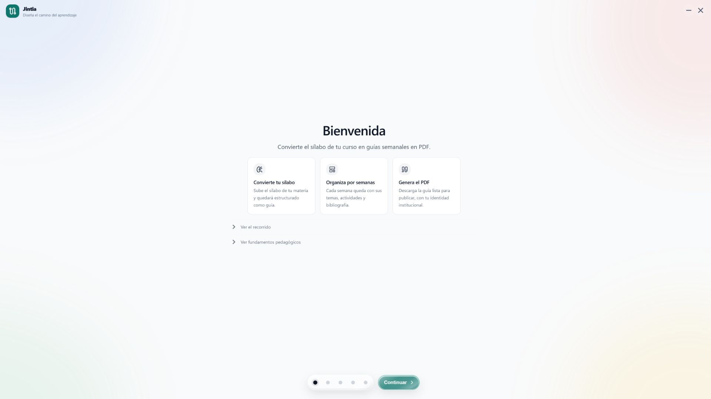
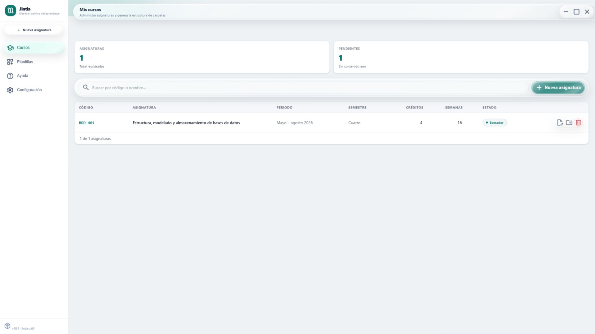
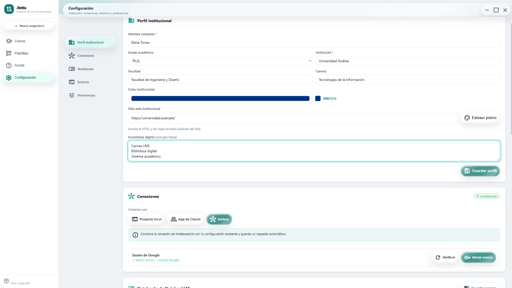
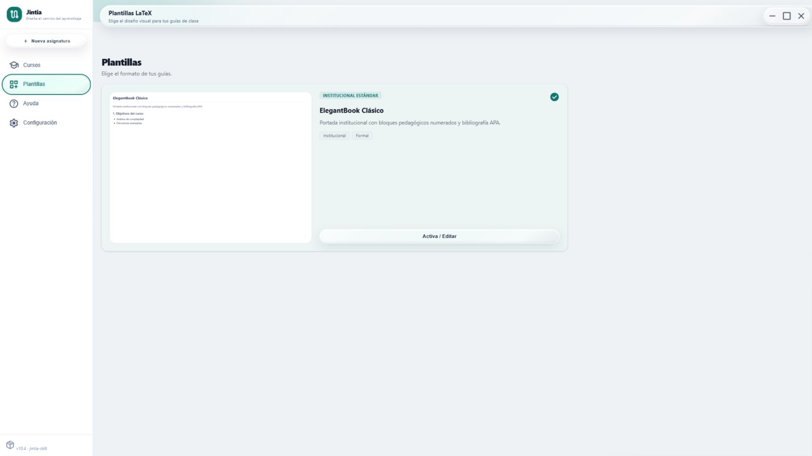

# Jintia

<p align="right">
  <a href="README.en.md">🇺🇸 English</a>
</p>

**Diseña el camino del aprendizaje.**

Aplicación de escritorio y skill para convertir un sílabo universitario en una
ruta conectada de resultados, contenidos, actividades, evaluaciones y guías
semanales listas para publicar.

[](CHANGELOG.md)
[](https://github.com/CharlieCardenasToledo/instructional-designer-skill/releases)
[](https://github.com/CharlieCardenasToledo/instructional-designer-skill/releases)
[](LICENSE)

## El objetivo

Preparar un entorno de diseño instruccional suele exigir instalar herramientas,
editar archivos de configuración, conectar NotebookLM y organizar manualmente
cada curso. Este proyecto reúne ese proceso en un solo producto:

- **Jintia Desktop** instala y configura el entorno mediante una interfaz
  gráfica.
- **`jintia-skill`** guía a Claude Code para producir sílabos,
  guías LaTeX, actividades y evaluaciones con criterios pedagógicos verificables.

La aplicación no sustituye a la skill. Es su instalador, configurador y centro
de gestión. La skill sigue siendo el motor que interpreta el curso y produce el
material académico.

```text
Descargar e instalar la aplicación
                ↓
Configurar institución, herramientas y NotebookLM
                ↓
Crear la asignatura y estructurar el sílabo
                ↓
Instalar o exportar la skill
                ↓
Trabajar con Claude Code
                ↓
Generar y validar las guías semanales en PDF
```

## El origen del nombre

Jintia toma su nombre de *Jíntia*, palabra registrada en Shuar Chicham con el significado de “camino”.

El nombre representa el propósito de la aplicación: convertir un sílabo en una ruta coherente de resultados, contenidos, actividades, evaluaciones y recursos.

En el Currículo Nacional Intercultural Bilingüe de la Nacionalidad Shuar, la expresión *Aarma jintia* se emplea para referirse a “textos instructivos”.

Reconocemos expresamente la procedencia lingüística shuar del término. El uso del nombre no implica representación, aprobación ni vinculación institucional con comunidades u organizaciones del pueblo Shuar.

## Recorrido por la aplicación

### 1. Configuración guiada

El onboarding explica el resultado esperado y verifica cada requisito antes de
habilitar el panel principal.



### 2. Gestión de asignaturas

Desde el panel se registran asignaturas y se crea su estructura de carpetas. El
panel muestra un resumen local —`Borrador` o `Con contenido`— a partir de los
datos semanales guardados; no sustituye un sistema de seguimiento editorial.



### 3. Identidad institucional

La aplicación conserva el nombre del docente, la institución, la carrera y la
paleta visual que utilizarán los documentos.



### 4. Plantilla editorial

La versión actual incluye `ElegantBook Clásico` para un flujo técnico de ancho
principal y `Kaohandt Marginal` para guías con columna pedagógica lateral. Las
dos comparten contratos portables para figuras, tablas, bloques y metadatos.



## Qué resuelve la aplicación

- Comprueba Node.js, Python, Git y un compilador LaTeX.
- En Windows, solicita autorización antes de iniciar una instalación con
  `winget`; en macOS y Linux muestra instrucciones manuales.
- Configura los datos institucionales y la identidad visual.
- Conecta NotebookLM MCP sin sobrescribir otras configuraciones.
- Instala la skill para Claude Code o la exporta para otros destinos.
- Crea la estructura canónica de una asignatura.
- Convierte el contenido semanal del sílabo en un `README.md` estructurado.
- Permite activar y previsualizar la plantilla LaTeX incluida.
- Mantiene localmente cursos, configuraciones, archivos y compilación.

## Qué produce la skill

Una vez instalada, la skill guía la creación de:

- guías semanales modulares en LaTeX;
- resultados, actividades y evaluaciones alineados;
- gráficos, mapas, redes, procesos, interfaces y diagramas disciplinares
  seleccionados por intención pedagógica;
- fuentes visuales editables, manifiesto de procedencia y renderizado
  reproducible mediante motores locales disponibles;
- bibliografía en APA 7 mediante `biblatex` y `biber`;
- secciones de recuperación, transferencia y aplicación profesional;
- documentos validados antes de la compilación final.

El flujo editorial aplica UDL 3.0, Backward Design, Quality Matters 7, WCAG
2.2, los principios multimedia de Mayer y prácticas de espaciado e
intercalado.

## Instalación

### Opción recomendada: aplicación de escritorio

Descargas directas de la última versión monorepo del Desktop:

| Sistema | Instalador | Descarga |
|---|---|---|
| Windows 10/11 x64 | NSIS `.exe` — recomendado | [Ver descargas](https://github.com/CharlieCardenasToledo/instructional-designer-skill/releases/latest) |
| Windows 10/11 x64 | Windows Installer `.msi` | [Ver descargas](https://github.com/CharlieCardenasToledo/instructional-designer-skill/releases/latest) |
| macOS Apple Silicon | Imagen de disco `.dmg` | [Ver descargas](https://github.com/CharlieCardenasToledo/instructional-designer-skill/releases/latest) |

También puedes consultar la
[release más reciente](https://github.com/CharlieCardenasToledo/instructional-designer-skill/releases/latest).
Después de instalar la aplicación, completa el onboarding y elige si quieres
instalar la skill localmente o exportarla.

> El DMG actual no está firmado ni notarizado y puede activar una advertencia
> de Gatekeeper. La firma requiere credenciales de Apple y todavía no forma
> parte del workflow público.

### Opción avanzada: instalación manual

Esta ruta está pensada para desarrollo o para usuarios que prefieren gestionar
la skill directamente.

```bash
git clone https://github.com/CharlieCardenasToledo/instructional-designer-skill.git
```

Después, copia o enlaza **el contenido de `skill/`** dentro de:

```text
Windows: %USERPROFILE%\.claude\skills\jintia-skill
macOS:   ~/.claude/skills/jintia-skill
Linux:   ~/.claude/skills/jintia-skill
```

La carpeta instalada debe contener `SKILL.md`, `config/`, `references/`,
`scripts/` y `templates/` directamente en su raíz. `agents/` y
`.claude-plugin/` son metadatos del repositorio y no son necesarios para
ejecutar la skill en Claude Code. La carpeta `app/` no debe copiarse.

## Uso

Cuando la skill ya está instalada, Claude Code puede activarla automáticamente
al reconocer una petición compatible:

```text
Crea la guía de la semana 3 para Bases de Datos.
Genera el módulo autoinstruccional de la unidad 2.
Estructura el sílabo y sus actividades por semana.
Valida y compila la guía en PDF.
```

También puede invocarse explícitamente como
`/jintia-skill`.

## Flujo editorial

1. Leer el `README.md` canónico del curso.
2. Identificar temas, resultados, actividades y bibliografía de la semana.
3. Consultar las fuentes disponibles mediante NotebookLM MCP.
4. Proponer la estructura de secciones y confirmar datos faltantes.
5. Generar archivos LaTeX modulares.
6. Ejecutar las reglas editoriales y de accesibilidad.
7. Compilar y revisar el PDF.

La estructura resultante mantiene una secuencia predecible:

```text
semanas/semana-XX/latex/
├── guia-semana-XX.tex
├── sections/
│   ├── 01-introduccion.tex
│   ├── 02-tema-principal.tex
│   ├── 03-tema-relacionado.tex
│   ├── 04-escenario.tex
│   ├── 05-aplicacion.tex
│   └── 06-bibliografia.tex
└── figure/
```

## Desarrollo de la aplicación

La aplicación utiliza Tauri 2, Rust, Vite y Tailwind CSS 4.

```bash
cd app/desktop
npm ci
npm test
npm run tauri:dev
```

Para generar instaladores localmente:

```bash
npm run tauri:build
```

Tauri produce los artefactos de cada plataforma dentro de
`app/desktop/src-tauri/target/release/bundle/`.

## Publicación automatizada

Los workflows de GitHub Actions ejecutan tests antes de construir:

- `release-windows.yml`: genera NSIS `.exe` y Windows Installer `.msi`.
- `release-macos.yml`: genera `.dmg` y el paquete de la aplicación.

Al crear un tag `v*`, los artefactos se adjuntan a la GitHub Release
correspondiente. Una ejecución manual valida la compilación y conserva sus
artefactos en GitHub Actions, pero no publica una Release.

## Estructura del repositorio

```text
jintia/
├── app/
│   └── desktop/            Aplicación Tauri y frontend
├── skill/                  Paquete instalable de la skill
│   ├── SKILL.md            Flujo principal
│   ├── agents/             Configuración para otros agentes
│   ├── config/             Esquemas de configuración
│   ├── references/         Reglas pedagógicas y editoriales
│   ├── scripts/            Linter, validadores y utilidades
│   └── templates/          Plantillas editoriales LaTeX
├── docs/                   Guías y capturas de la aplicación
└── .github/workflows/      Construcción de instaladores
```

## Privacidad

La aplicación no incorpora telemetría ni envía cursos a un servidor del
proyecto. Los archivos, la validación y la compilación se procesan localmente.
Las consultas a NotebookLM se envían a los servicios de Google mediante el MCP
configurado por el usuario. Extraer una paleta desde un sitio web e instalar
dependencias también requiere conexión. Un ZIP exportado puede incluir la
configuración institucional y las referencias de notebooks; revísalo antes de
compartirlo.

Consulta la [política de privacidad completa](PRIVACY.md).

## Code signing policy

Los instaladores Windows de la release actual no están firmados. El proyecto
está preparando su incorporación al programa open source de SignPath
Foundation. Después de la aprobación, solo se publicarán como firmados los
artifacts construidos, verificados y aprobados mediante GitHub Actions.

Free code signing provided by [SignPath.io](https://signpath.io/), certificate
by [SignPath Foundation](https://signpath.org/).

Consulta la [política de firma](CODE_SIGNING_POLICY.md) y el
[estado de la solicitud](docs/signpath-application.md).

## Documentación adicional

- [Manual técnico de la aplicación](app/desktop/README.md)
- [Uso con Claude Code, Claude Skills, Projects y Cowork](docs/guia-claude-desktop.md)
- [Arquitectura](docs/architecture.md)
- [Sistema visual de Jintia](docs/design-system.md)
- [Proceso de publicación](docs/releasing.md)
- [Cómo contribuir](CONTRIBUTING.md)
- [Autoría y mantenimiento](AUTHORS.md)
- [Cómo citar Jintia](CITATION.cff)
- [Avisos de terceros](THIRD_PARTY_NOTICES.md)
- [Política de seguridad](SECURITY.md)
- [Política de privacidad](PRIVACY.md)
- [Política de firma](CODE_SIGNING_POLICY.md)
- [Historial de versiones](CHANGELOG.md)
- [Licencia MIT](LICENSE)

MIT © 2026 Charlie Cárdenas Toledo.
