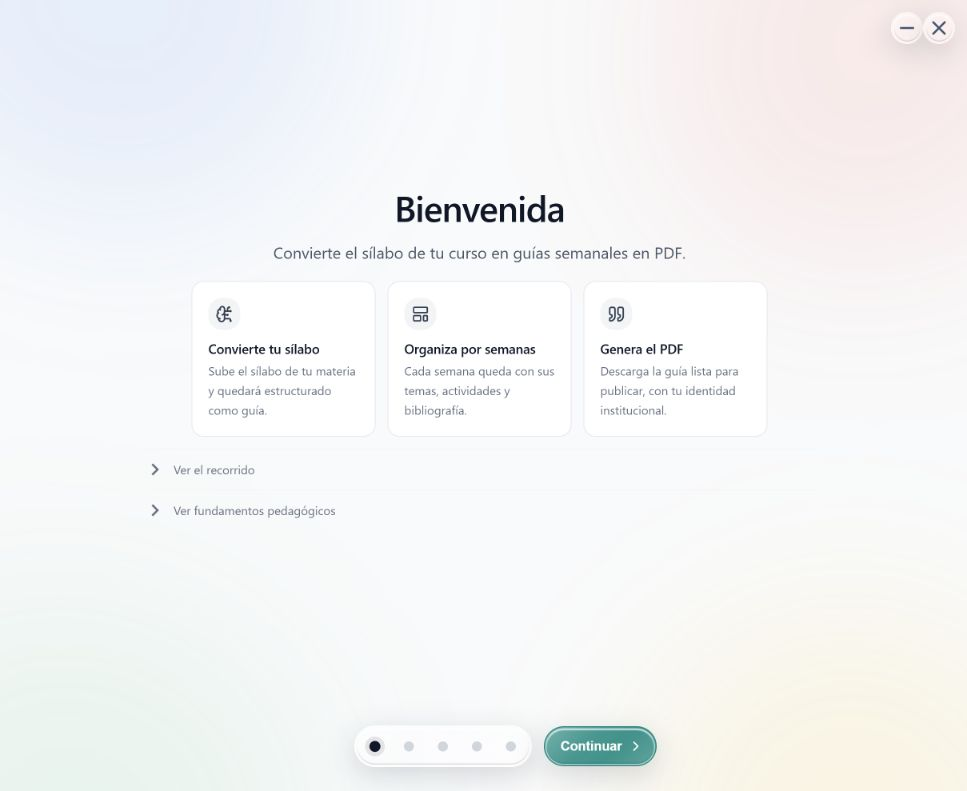
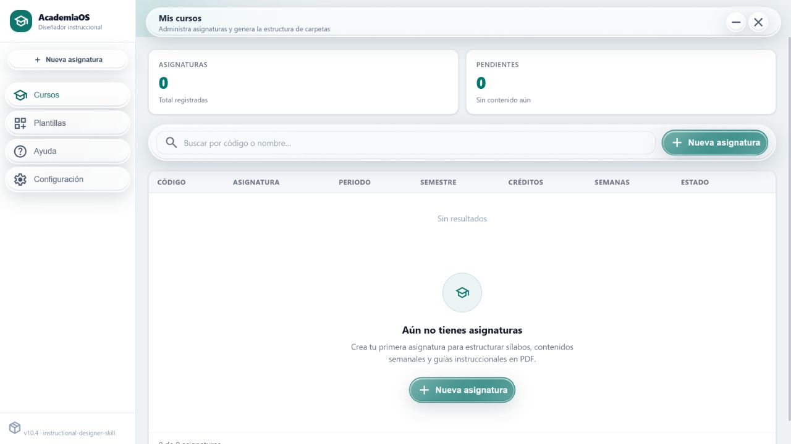
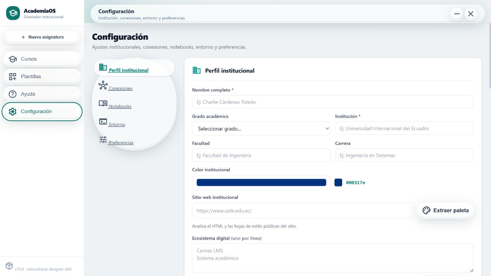
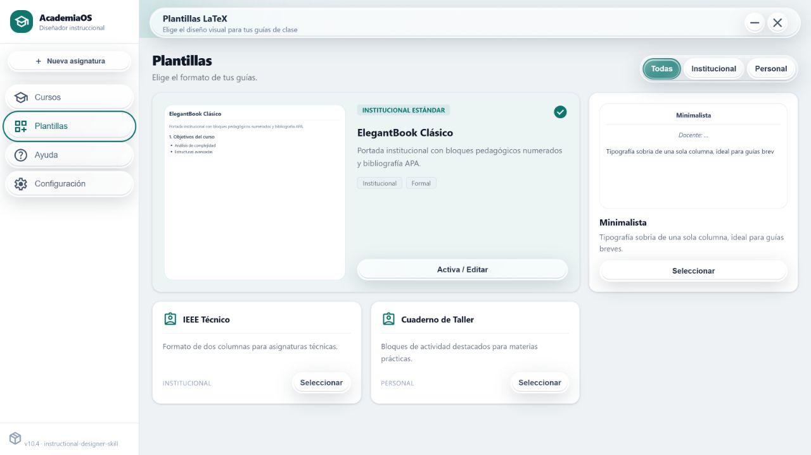

# Instructional Designer

Aplicación de escritorio y skill para transformar un sílabo universitario en
una estructura de curso y en guías semanales listas para publicar.

[](CHANGELOG.md)
[](https://github.com/CharlieCardenasToledo/instructional-designer-skill/releases)
[](https://github.com/CharlieCardenasToledo/instructional-designer-skill/releases)
[](LICENSE)

## El objetivo

Preparar un entorno de diseño instruccional suele exigir instalar herramientas,
editar archivos de configuración, conectar NotebookLM y organizar manualmente
cada curso. Este proyecto reúne ese proceso en un solo producto:

- **Instructional Designer Manager** instala y configura el entorno mediante
  una interfaz gráfica.
- **`instructional-designer-skill`** guía a Claude Code para producir sílabos,
  guías LaTeX, actividades y evaluaciones con criterios pedagógicos verificables.

La aplicación no sustituye a la skill. Es su instalador, configurador y centro
de gestión. La skill sigue siendo el motor que interpreta el curso y produce el
material académico.

```text
Descargar e instalar la aplicación
                ↓
Configurar institución, herramientas y NotebookLM
                ↓
Crear la asignatura y estructurar el sílabo
                ↓
Instalar o exportar la skill
                ↓
Trabajar con Claude Code
                ↓
Generar y validar las guías semanales en PDF
```

## Recorrido por la aplicación

### 1. Configuración guiada

El onboarding explica el resultado esperado y verifica cada requisito antes de
habilitar el panel principal.



### 2. Gestión de asignaturas

Desde el panel se crean asignaturas, se genera su estructura de carpetas y se
mantiene el estado de producción de cada curso.



### 3. Identidad institucional

La aplicación conserva el nombre del docente, la institución, la carrera y la
paleta visual que utilizarán los documentos.



### 4. Plantillas editoriales

Cada curso puede utilizar una plantilla institucional, minimalista, técnica o
orientada a talleres.



## Qué resuelve la aplicación

- Comprueba Node.js, Python, Git y un compilador LaTeX.
- Solicita autorización antes de instalar una dependencia.
- Configura los datos institucionales y la identidad visual.
- Conecta NotebookLM MCP sin sobrescribir otras configuraciones.
- Instala la skill para Claude Code o la exporta para otros destinos.
- Crea la estructura canónica de una asignatura.
- Convierte el contenido semanal del sílabo en un `README.md` estructurado.
- Permite seleccionar y previsualizar plantillas LaTeX.
- Mantiene toda la información y los procesos en el equipo del usuario.

## Qué produce la skill

Una vez instalada, la skill guía la creación de:

- guías semanales modulares en LaTeX;
- resultados, actividades y evaluaciones alineados;
- diagramas semánticos con TikZ;
- bibliografía en APA 7 mediante `biblatex` y `biber`;
- secciones de recuperación, transferencia y aplicación profesional;
- documentos validados antes de la compilación final.

El flujo editorial aplica UDL 3.0, Backward Design, Quality Matters 7, WCAG
2.2, los principios multimedia de Mayer y prácticas de espaciado e
intercalado.

## Instalación

### Opción recomendada: aplicación de escritorio

1. Abre la página de
   [Releases](https://github.com/CharlieCardenasToledo/instructional-designer-skill/releases/latest).
2. Descarga el instalador correspondiente:
   - Windows: `.exe` o `.msi`.
   - macOS: `.dmg`.
3. Instala la aplicación y completa el onboarding.
4. Elige si quieres instalar la skill localmente o exportarla.

> Los instaladores de macOS sin firma pueden activar una advertencia de
> Gatekeeper. La firma y notarización requieren credenciales de Apple y se
> aplican durante el workflow de publicación cuando esos secretos están
> configurados.

### Opción avanzada: instalación manual

Esta ruta está pensada para desarrollo o para usuarios que prefieren gestionar
la skill directamente.

```bash
git clone https://github.com/CharlieCardenasToledo/instructional-designer-skill.git
```

Después, copia o enlaza el repositorio dentro de:

```text
Windows: %USERPROFILE%\.claude\skills\instructional-designer-skill
macOS:   ~/.claude/skills/instructional-designer-skill
Linux:   ~/.claude/skills/instructional-designer-skill
```

## Uso

Cuando la skill ya está instalada, Claude Code puede activarla automáticamente
al reconocer una petición compatible:

```text
Crea la guía de la semana 3 para Bases de Datos.
Genera el módulo autoinstruccional de la unidad 2.
Estructura el sílabo y sus actividades por semana.
Valida y compila la guía en PDF.
```

También puede invocarse explícitamente como
`/instructional-designer-skill`.

## Flujo editorial

1. Leer el `README.md` canónico del curso.
2. Identificar temas, resultados, actividades y bibliografía de la semana.
3. Consultar las fuentes disponibles mediante NotebookLM MCP.
4. Proponer la estructura de secciones y confirmar datos faltantes.
5. Generar archivos LaTeX modulares.
6. Ejecutar las reglas editoriales y de accesibilidad.
7. Compilar y revisar el PDF.

La estructura resultante mantiene una secuencia predecible:

```text
semanas/semana-XX/latex/
├── guia-semana-XX.tex
├── sections/
│   ├── 01-introduccion.tex
│   ├── 02-tema-principal.tex
│   ├── 03-tema-relacionado.tex
│   ├── 04-escenario.tex
│   ├── 05-aplicacion.tex
│   └── 06-bibliografia.tex
└── figure/
```

## Desarrollo de la aplicación

La aplicación utiliza Tauri 2, Rust, Vite y Tailwind CSS 4.

```bash
cd desktop-manager
npm ci
npm test
npm run tauri:dev
```

Para generar instaladores localmente:

```bash
npm run tauri:build
```

Tauri produce los artefactos de cada plataforma dentro de
`desktop-manager/src-tauri/target/release/bundle/`.

## Publicación automatizada

Los workflows de GitHub Actions ejecutan tests antes de construir:

- `release-windows.yml`: genera NSIS `.exe` y Windows Installer `.msi`.
- `release-macos.yml`: genera `.dmg` y el paquete de la aplicación.

Al crear un tag `v*`, los artefactos se adjuntan a la GitHub Release
correspondiente. Ambos workflows también pueden ejecutarse manualmente.

## Estructura del repositorio

```text
instructional-designer-skill/
├── desktop-manager/        Aplicación Tauri y frontend
├── SKILL.md                Flujo principal de la skill
├── agents/                 Configuración para otros agentes
├── templates/              Plantillas editoriales LaTeX
├── references/             Reglas pedagógicas, visuales y bibliográficas
├── scripts/                Linter, compilación y utilidades
├── config/                 Esquemas de configuración
└── docs/                   Guías y capturas de la aplicación
```

## Privacidad

La aplicación no incorpora telemetría ni envía el contenido de los cursos a
un servidor propio. Las operaciones de archivos, validación y compilación se
realizan localmente. Las consultas a NotebookLM utilizan la instancia MCP
configurada por el usuario.

## Documentación adicional

- [Manual técnico de la aplicación](desktop-manager/README.md)
- [Uso con Claude Desktop y Cowork](docs/guia-claude-desktop.md)
- [Historial de versiones](CHANGELOG.md)
- [Licencia MIT](LICENSE)

MIT © 2026 Charlie Cárdenas Toledo.
